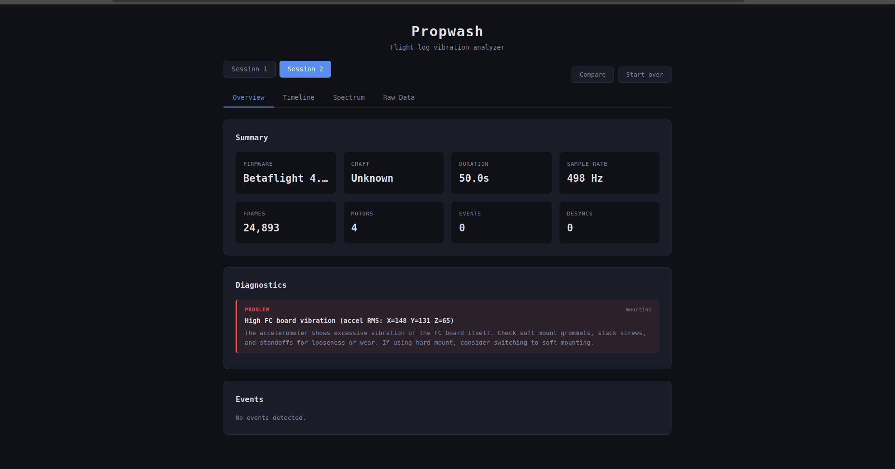
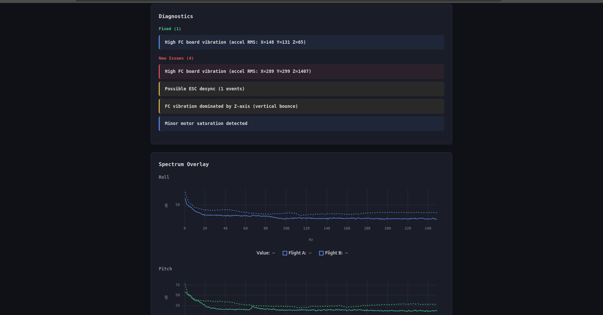

# propwash

Drone flight log analyzer. Parses Betaflight blackbox (`.bbl`), ArduPilot DataFlash (`.bin`), and PX4 ULog (`.ulg`) logs to detect vibration issues, PID tuning problems, motor saturation, gyro spikes, and mechanical faults - with frequency spectrum analysis and actionable diagnostics.

**Try it now: [propwash.deltave.org](https://propwash.deltave.org)** - drop a log file in your browser. No install, no uploads. Runs locally via WebAssembly.





```
$ propwash analyze flight.bbl

── Session 1 ──
  Firmware:    Betaflight 4.2.9
  Craft:       DIATONE ROMA F5
  Duration:    89.0s
  Sample rate: 249 Hz
  Motors:      4

  Timeline (68 episodes):
      10.486s  GYRO SPIKE     pitch peak 677°/s (47 frames) (185ms)
      10.647s  OVERSHOOT      pitch peak 205% (14 frames) (52ms)
      25.429s  MOTOR SAT      motor[0] for 8 frames
      88.255s  GYRO SPIKE     pitch peak 2032°/s (103 frames) (414ms)

  Vibration Analysis (full flight):
    roll axis — noise floor 22.3 dB:
      #1: 205 Hz at 45.2 dB
      #2: 51 Hz at 32.0 dB
    pitch axis — noise floor 21.3 dB:
      #1: 218 Hz at 41.4 dB

  Vibration by Throttle:
    0-25%:   roll dominant 34 Hz    ← propwash
    25-50%:  roll dominant 205 Hz   ← frame resonance
    75-100%: roll dominant 21 Hz    ← PID oscillation

  Diagnostics:
    !!  [motors] Motor[0] saturating significantly more than others
    !!  [pid] Severe pitch overshoot (peak 372%, avg 78%)
    !!  [mechanical] Extreme pitch gyro spike (2032°/s)
```

## Web UI

Features: tabbed interface (Overview, Timeline, Spectrum, Raw Data), interactive ECharts plots with zoom/pan, spectrogram heatmaps, filter overlay, throttle-band analysis, side-by-side flight comparison.

## Install (CLI)

Download a prebuilt binary from [Releases](https://github.com/Iteratrix/propwash/releases), or build from source:

```bash
cargo install --git https://github.com/Iteratrix/propwash propwash
```

## Usage

```bash
# Full analysis with event timeline, vibration FFT, and diagnostics
propwash analyze flight.bbl

# JSON output for programmatic consumption
propwash analyze flight.bbl --output json

# Log metadata and field inventory
propwash info flight.bbl

# Batch triage of multiple files
propwash scan *.bbl *.bin *.ulg

# Side-by-side comparison of two flights
propwash compare before.bbl after.bbl

# Raw frame dump (for debugging / agentic analysis)
propwash dump flight.bbl --session 2 --frames 100-200 --fields gyroADC,motor
```

## What it detects

**Events:**
- Throttle chops and punches (rapid throttle changes)
- Motor saturation (motor hitting max output)
- Gyro spikes (extreme rotation rates)
- Setpoint overshoot (PID tracking errors)
- ESC desync (single motor spike)
- Firmware messages (PX4 log messages, ArduPilot error codes)

**Vibration:**
- Frequency spectrum per axis (FFT with Hann windowing)
- Top 5 frequency peaks with noise classification (motor noise vs frame resonance)
- Throttle-windowed analysis (how vibration changes with motor speed)
- Spectrogram (frequency vs time heatmap)
- Accelerometer vibration (FC mounting quality)

**Diagnostics:**
- Asymmetric motor saturation → mechanical issue on one side
- Severe overshoot → P/D imbalance with axis-specific recommendation
- Extreme gyro spikes → crash/damage detection
- Frame resonance → notch filter recommendation
- Throttle-dependent frequency shift → motor noise (RPM filtering)
- FC mounting issues → accelerometer RMS analysis

## Supported formats

| Firmware | Format | Status |
|----------|--------|--------|
| Betaflight | `.bbl` blackbox | Full support |
| EmuFlight | `.bbl` blackbox | Full support |
| Rotorflight | `.bbl` blackbox | Full support |
| INAV | `.bbl` blackbox | Full support |
| Cleanflight | `.bbl` blackbox | Full support |
| ArduPilot (Copter/Plane/Rover) | `.bin` DataFlash | Full support |
| PX4 | `.ulg` ULog | Full support |

## Architecture

```
propwash-core/          Parser library (can be used independently)
  format/bf/            Betaflight-family blackbox decoder
  format/ap/            ArduPilot DataFlash decoder
  format/px4/           PX4 ULog decoder
  analysis/             Event detection, FFT, diagnostics
propwash/               CLI binary
propwash-web/           WASM bridge (powers the web UI)
web/                    Browser frontend (vanilla JS + ECharts + uPlot)
```

Two-layer API for library consumers:
- **`session.unified()`** — format-agnostic sensor data via the `Unified` trait
- **`session.raw`** — format-specific parsed data (behind `features = ["raw"]`)

Typed field access:
```rust
use propwash_core::types::{SensorField, Axis};

let gyro = session.unified().field(&SensorField::Gyro(Axis::Roll));
```

## Performance

Parses a 15MB Betaflight log (472K frames) in 250ms. 45x faster than Python parsers.

## License

MIT
